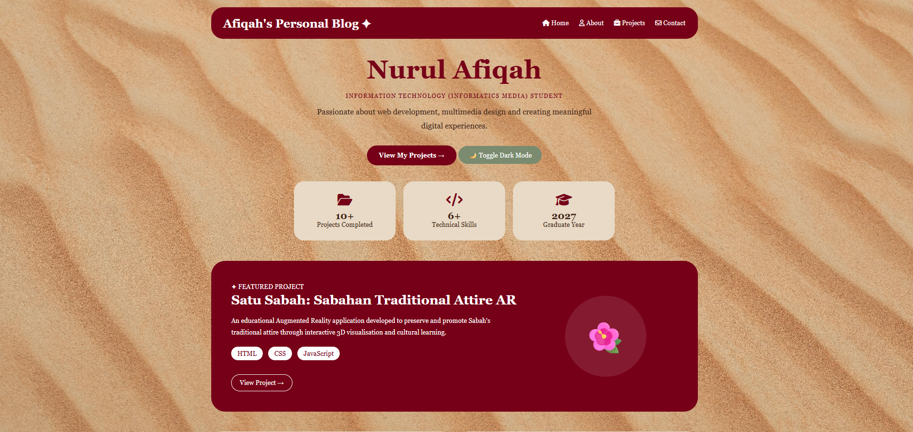
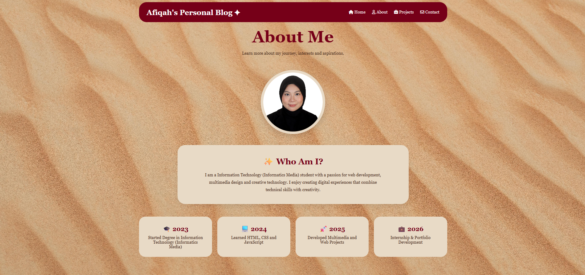
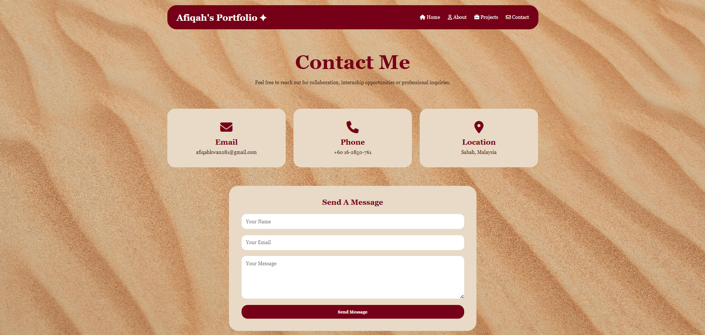

# 🌸 Nurul Afiqah Portfolio Website

## 🌐 Project Overview

This project is a personal portfolio website developed to showcase my academic background, technical skills, multimedia projects, and professional information through a modern and responsive user interface.

The website was built using HTML, CSS, and JavaScript, featuring interactive elements such as Dark Mode, scroll animations, and mobile-responsive layouts.

---

## ✨ Features

- Responsive design for desktop, tablet, and mobile devices
- Interactive navigation menu
- Personal introduction and profile section
- About Me page
- Project showcase pages
- Contact page
- Dark Mode toggle
- Scroll fade-in animations
- GitHub Pages deployment

---

## 📄 Website Pages

### 🏠 Home Page
Provides a brief introduction about me, highlights my skills, and features selected projects.

### 👤 About Page
Contains information about my educational background, interests, technical skills, achievements, and future career aspirations.

### 💼 Projects Page
Showcases multimedia and software development projects completed throughout my studies.

### 🌺 Salu Sabah Project Page
A dedicated project page presenting the development process, objectives, technologies used, galleries, challenges, and outcomes of the Salu Sabah Augmented Reality application.

### 🎥 Animation Portfolio Page
A collection of 2D and 3D animation projects demonstrating visual storytelling, motion graphics, modelling, and animation skills.

### 📧 Contact Page
Displays contact information and provides a professional platform for communication.

---

## 🚀 Featured Project

### 🌺 Salu Sabah: Sabahan Traditional Attire AR

Salu Sabah is an Augmented Reality (AR) application developed to preserve and promote Sabah's traditional attire through interactive digital learning.

### Key Features

- Augmented Reality visualization
- Interactive cultural learning experience
- 20 traditional attire 3D models
- Digital storybook integration
- Information panels for each attire
- Educational and heritage preservation focus

### Tools & Technologies

- Unity
- Autodesk Maya
- C#
- HTML
- CSS
- JavaScript
- Canva
- Adobe Photoshop
- Augmented Reality (AR)

---

## 🎥 Animation Portfolio

The Animation Portfolio showcases a variety of multimedia projects involving both 2D and 3D animation.

### Featured Works

- 2D Animation Projects
- 3D Animation Showcase
- Motion Graphics
- Visual Storytelling Projects
- Character Animation
- Multimedia Production

### Software Used

- Autodesk Maya
- Blender
- Adobe After Effects
- CapCut
- Adobe Photoshop

---

## 🎨 Graphic Design Portfolio

A collection of creative design works including:

- Posters
- Social Media Content
- Promotional Materials
- Digital Graphics
- Multimedia Design Projects

---

## 🛠 Technologies Used

### Front-End Development

- HTML5
- CSS3
- JavaScript

### Multimedia Tools

- Autodesk Maya
- Blender
- Adobe Photoshop
- Adobe After Effects
- Canva
- CapCut

### Development Tools

- Visual Studio Code
- GitHub
- GitHub Pages

---

## 🎨 Additional Features

### 🌙 Dark Mode

Allows users to switch between light and dark themes for improved accessibility and user preference.

### ✨ Scroll Animation

Cards and sections smoothly fade into view as users scroll through the website.

### 📱 Responsive Design

The website automatically adapts to different screen sizes, ensuring usability across desktop, tablet, and mobile devices.

---

## 📸 Website Preview

### Home Page

### About Page

### Projects Page

(Add Screenshot Here)

### Contact Page

---

## 🔗 Live Website

GitHub Pages:

https://afiqah076796.github.io/nurul-afiqah-portfolio/

---

## 👩‍💻 Author

**Nurul Afiqah**

Degree in Information Technology ( Informatics Media )

Faculty of Informatics & Computing

2026
